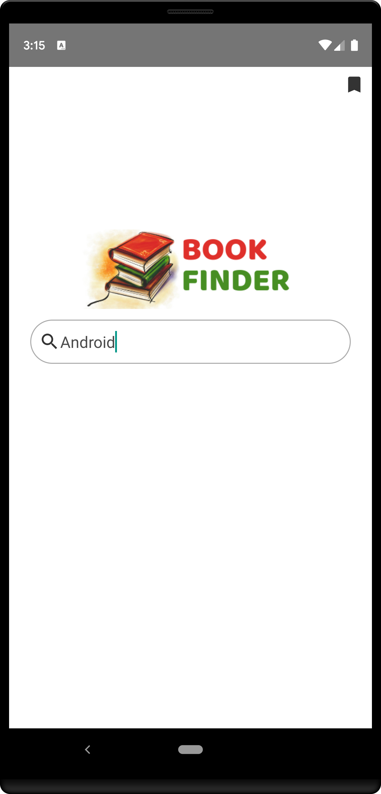
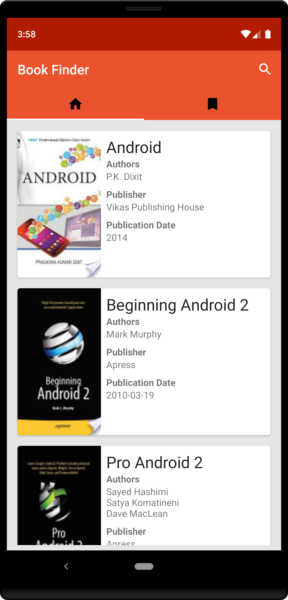
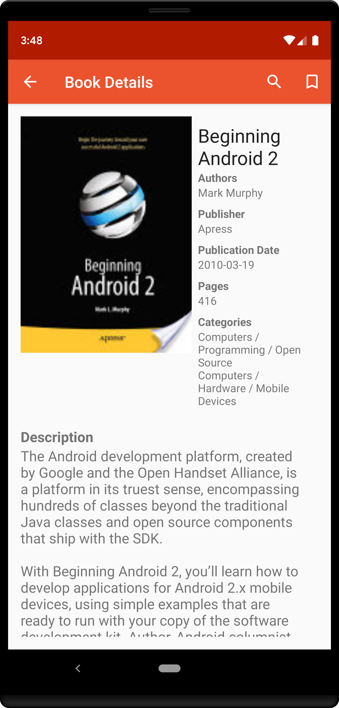
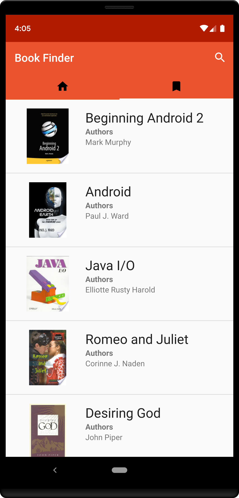

# Book Finder

The Book Finder is a simple android app that allows user search for books by name from the Google 
Books API, bookmark favorites and manage bookmarks. It Android Architecture Components such as: 

* [Room](https://developer.android.com/topic/libraries/architecture/room)
* [LiveData](https://developer.android.com/topic/libraries/architecture/livedata)
* [ViewModel](https://developer.android.com/topic/libraries/architecture/viewmodel)

More information about the Android Architecture Components are available at [https://developer.android.com](https://developer.android.com/topic/libraries/architecture).

## Screenshots

 &nbsp;  
&nbsp;  &nbsp; 

## Demo

Download the demo APK [here](book_finder.apk).